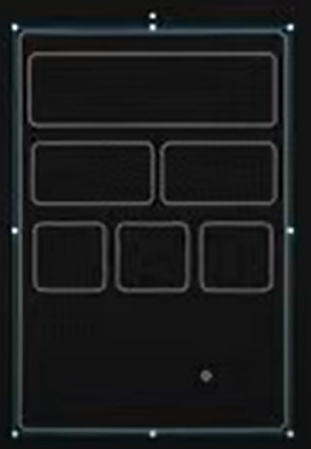
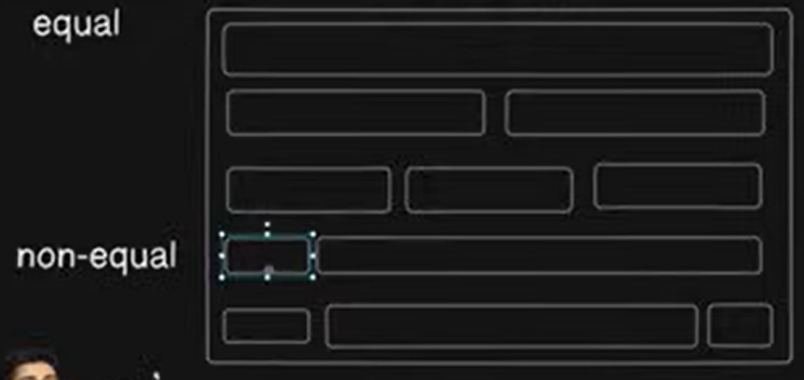
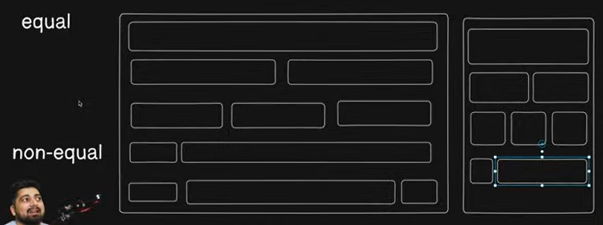

- You need to analyze the websites. If you can able to analyze it then its development is easy.
- Don't see website as top to bottom instead see it as row wise.
- In mobile devices, space is low. So if you give small elements then it will be difficult for users to tap.
- Mobile's ui principle says that, either give full space to element (left to right or row) or you can divide it in two parts.
    
    In this image you can see that, when we set three elements in a row its size gets small and it is difficult for users.
    Give maximum 3 elements in a row in mobile devices not more.

- Equal and non-equal layouts
    
    For non-equal layouts, you can see twitter's website.

    - When you want to make non-equal layouts then first of all think about your parent element and take grid-cols-12. So that full row can divide into 12 parts.
    - Decide ratio for each component of website.

