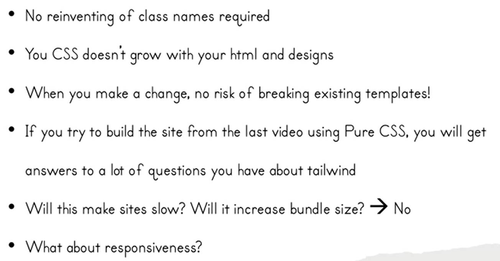
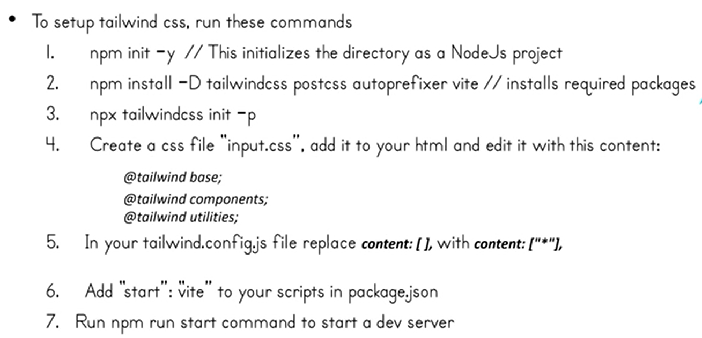

# Tailwind CSS

- **Tutorial Link: YouTube -- <a href="https://www.youtube.com/playlist?list=PLu0W_9lII9ahwFDuExCpPFHAK829Wto2O">Tailwind Tutorial in Hindi - Code with Harry</a>**
- We can able to use tailwind playCDN in development but not in production.

## Why use tailwind
- You don't need to make names for classes. 
- If you use pure CSS and use that particular class in many components then by changing CSS for one component can break other component. But in tailwind you're building separate CSS for components.
- tailwind only ships the classes which are used in that page. So it will not increase bundle size and not make site slow.
- Tailwind have given breakpoints so at particular breakpoint you can change css. So it's responsive.

- utility classes are made by analyzing many factors. So they give consistancy.

## Setting up Tailwind CSS

- Use Extension: **Tailwind CSS IntelliSense** for better experience.

## postcss.config
- postcss.config file will see tailwind.config file and then observe all the    files which are included in content: [] then it will bring only those css classes which are used in those files to styles.css

## Square Bracket Notation
- It's used to put custom values. Means if any value such as margin = 148px is missing in tailwind but you want it then you can use square bracket notation.
- Don't use square bracket notation always. Because we want to minimize our production bundle. If we use square bracket notation then that css will be added to styles and it increases the production bundle. It means if you use `mx-[67]` and change `67` to other values and use it multiple times then that much css will added to `styles.css`. You can see it in `inspect tab -> styles.css`.

## Responsive Design
- In tailwind we don't need to use media queries of css. It provides us breakpoints by which we can make responsive designs.
- Start with small screens to style and as minimum width becomes 640px then apply sm then for 768px use md and so on.
- use unprefixed utilities to target mobile and override them at larger breakpoints.
- Tailwind gives you access to change value of these breakpoints or add custom breakpoint using config file.

## @apply directive
- In tailwind css we can group many classes and use it by giving a name to it.

        .btn {
            @apply text-white bg-yellow-400 hover:bg-yellow-500 focus:outline-none focus:ring-4 focus:ring-yellow-300 font-medium rounded-full text-sm px-5 py-2.5 text-center me-2 mb-2 dark:focus:ring-yellow-900
        }

- Now you can use this class in html.